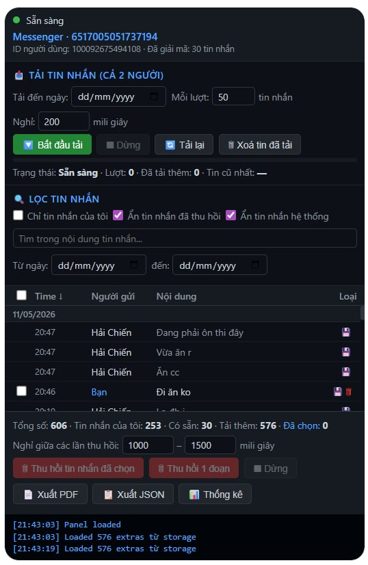

# 💬 Messenger Recall Tool

> A Chrome side-panel extension for **archiving, searching, exporting and managing** your own Facebook Messenger conversations — including E2EE threads.
>
> ⚡ Bypasses the 100-message client cache. Decrypts CDN images. Exports PDF.
> 🧪 **For personal & educational research only.**

<p align="center">
  
</p>

---

## 🎥 Demo

| Desktop | Mobile |
|---|---|
| [▶ demopc.mp4](media/demopc.mp4) | [▶ demomobile.mp4](media/demomobile.mp4) |

> GitHub does not autoplay `.mp4` inline. Click to download/play.

---

## ⚠️ Disclaimer

This project is **independent research**. It is **not affiliated with, endorsed by, or sponsored by Meta Platforms, Inc., Facebook, WhatsApp, or any related entity**.

- Use **at your own risk** and **on your own account only**.
- Using this tool may violate Facebook's [Terms of Service](https://www.facebook.com/legal/terms). You alone are responsible for any consequences (rate limits, account flags, suspension).
- Provided **AS-IS**, with **no warranty**. See [LICENSE](LICENSE).
- The author does not condone using this tool to harass, stalk, deceive, or harm anyone. **Don't be a jerk.**

If you are a Meta employee and would like this taken down, please open an issue first — happy to discuss.

---

## ✨ What it does

| Feature | Description |
|---|---|
| 📥 **Load history beyond cache** | Messenger only keeps ~100 recent messages locally. This tool paginates the internal bridge API to load months/years of history into memory. |
| 🔍 **Search & filter** | Full-text search across all loaded messages. Filter by date range, sender, status (unsent, system), keyword. |
| 🖼️ **Image preview & download** | Detects embedded JPEG/PNG and CDN-encrypted images (`.enc`). Decrypts CDN images using the message's mediaKey via HKDF-SHA256 + AES-256-CBC. |
| 📞 **Call event detection** | Parses inline call protobufs — shows `[cuộc gọi nhỡ 0:03]`, `[video call 1:23]` etc. with type & duration. |
| 📄 **Export as PDF** | Renders selected messages as a Messenger-style chat page (bubbles, avatars, date dividers) and opens in a new tab → print → save as PDF. |
| 📋 **Export as JSON** | Structured dump with participants, names, timestamps, message types — for further processing. |
| 📊 **Statistics dashboard** | Total messages, you vs them %, by hour-of-day chart, by month chart, media count, total call duration. |
| 🗑️ **Bulk recall** | Select messages (or shift-click range) → recall via E2EE protocol. Random delay between requests (anti-rate-limit). |
| 💾 **Persistent extras** | Fetched extras saved per-thread to `chrome.storage.local` (TTL 7 days). |

---

## 🚀 Install

1. `git clone https://github.com/quyanhfex/messenger-recall-tool.git`
2. Open `chrome://extensions/` → enable **Developer mode** (top right)
3. Click **Load unpacked** → select the cloned folder
4. Pin the extension; open Messenger; click the extension icon to open the side panel

> **No Chrome Web Store version.** This will probably stay unpacked-only.

---

## 🔧 How it works (high level)

```
┌─────────────────────────────────────────────────────────────┐
│  Chrome Side Panel  ←  RPC  →  Content Script  ←  RPC  →   │
│  (panel.html/js)                (content_script.js)         │
│                                       ↓ window.postMessage  │
│                                       ↓                     │
│            MAIN world injector (injector.js)                │
│                ↓                                            │
│       window.require('MAWBridgeSendAndReceive')             │
│                ↓                                            │
│       MAW Worker  →  Facebook backend  →  E2EE peers        │
└─────────────────────────────────────────────────────────────┘
```

- **Walker** parses the toplevel protobuf payload from each `mpsLoadMessages` response without a `.proto` schema — looks at wire-format tags and decodes UTF-8 leaves heuristically.
- **CDN image decryption** follows the WhatsApp media-key derivation (`HKDF salt=zeros, info="WhatsApp Image Keys"`) → AES-256-CBC.
- **Bulk recall** calls `MAWBridgeSendAndReceive.sendAndReceive('backend', 'sendRevokeMsg', { msgId: { author: '@me', chat, externalId }, ... })` directly, bypassing the React UI.

Full notes are inline comments in [`injector.js`](messenger-recall/injector.js).

---

## ⚖️ License

[MIT](LICENSE) — do what you want, but the disclaimer above stands.

---

## 🙏 Acknowledgements

Inspired by [shoot-the-messenger](https://github.com/theahura/shoot-the-messenger) (DOM-based approach). This project explores the bridge-API route.

---

## ❓ FAQ

**Q: Will my account get banned?**
A: I don't know. I haven't been banned, but I'm a sample size of one. Lower the bulk-recall delay carefully.

**Q: Why are some messages `[không decode được]`?**
A: Probably an attachment type not yet handled (stickers, location share, reply quote, etc.). PRs welcome.

**Q: Can it recall messages from missed calls / call events?**
A: No. Facebook silently rejects revoke for call events server-side — verified empirically. The local DB will mark them `isUnsent: true`, but the peer never receives the revoke.

**Q: Why so much Vietnamese in the UI?**
A: Built for personal use first. PRs to add i18n welcome.
